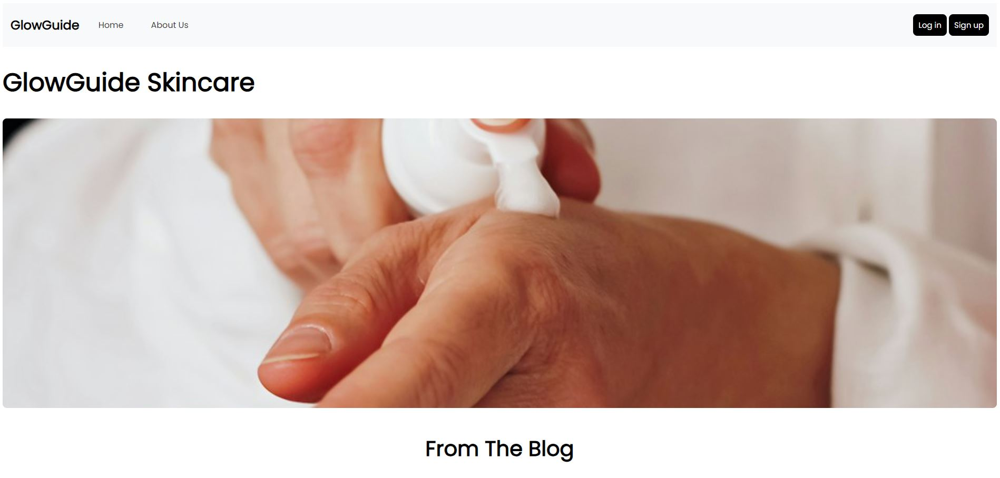
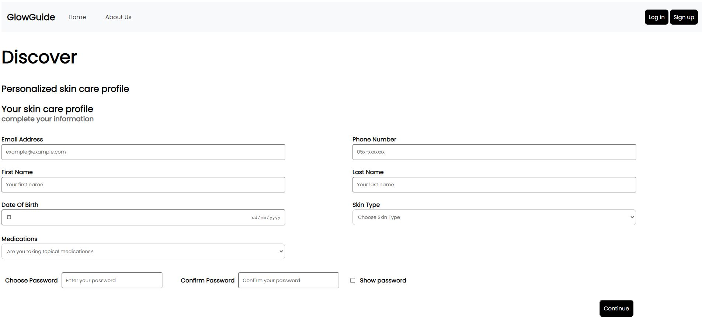
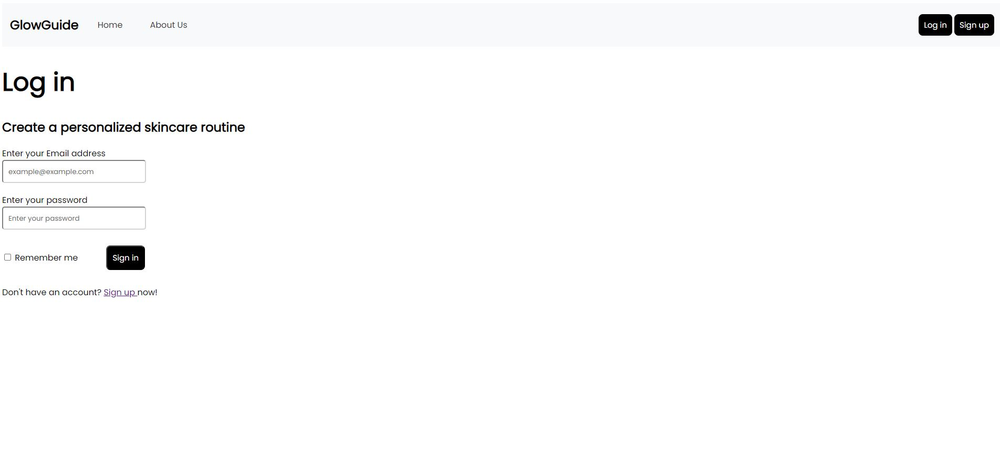
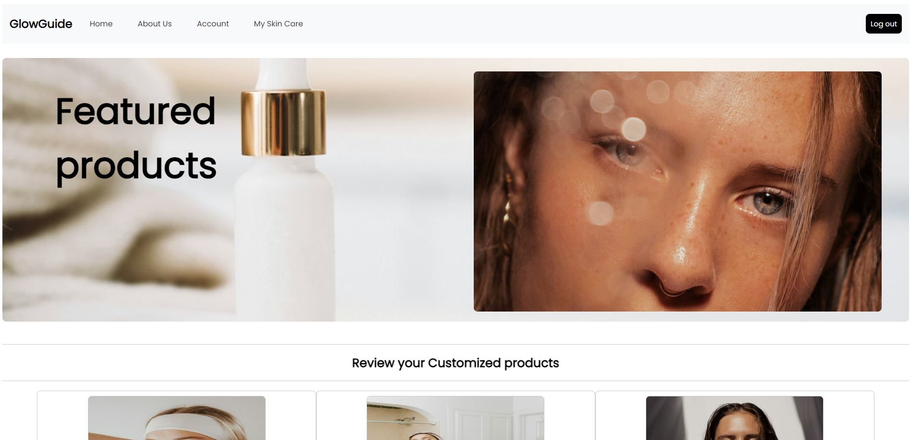
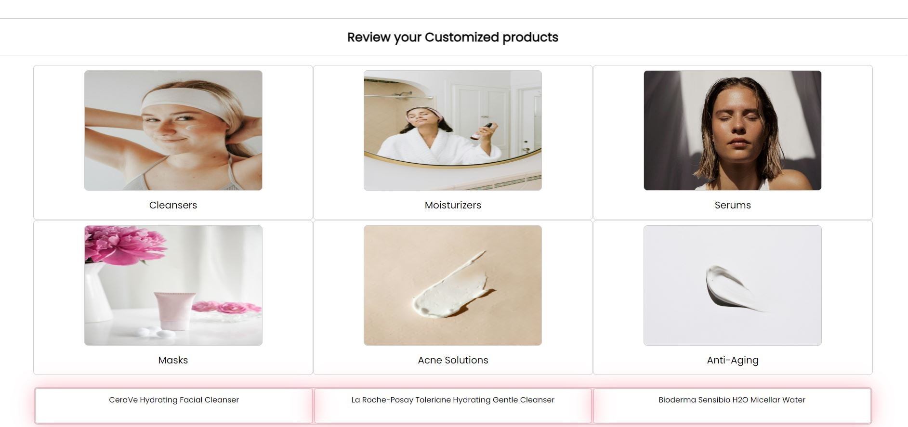

# GlowGuide Client-Server Application

## Project Overview

This part of the project is the server-side implementation of the GlowGuide website, which provides personalized
skincare recommendations to users based on the details they provide, as well as links to websites that offer the
relevant products.

### Detailed Instructions Implementation:

1. **Project Folder Structure**

   The project follows a structured folder organization:

    - **Components:** Contains shared components like the header.
    - **Templates:** Holds HTML files, including the base template for the website.
    - **Static:** Contains subfolders for general CSS and JavaScript files.
    - **Pages:** Each page has its own folder with static assets, HTML templates, and corresponding Python files.
      Additional files include `db_connector.py`, `settings.py`, and `app.py`.

2. **Handling Routing Client Requests**

   Functions are created to handle client requests, adhering to standard practices taught in class.

3. **Connection to Database and SQL Queries**

   The project uses a MongoDB database named "mydatabase" with collections for customers and products. SQL queries are
   executed for screens such as myskincare, login, and signup.

4. **Implementation of Forms**

   Forms, including login and signup forms, are implemented to handle user input. Forms interact with the database for
   operations like selecting, adding, updating, and deleting information.

5. **Translation of HTML Pages into Templates**

   HTML pages are converted into templates to enable dynamic content rendering based on user inputs.

## Order of Operations:

1. **Home Screen:** Users land on the home screen.
2. **Signup/Login:** Users can register or log in.
3. **Myskincare Page:** After successful login, users are redirected to the myskincare page.

## Screenshots:

- **Home Screen:**
  

- **Signup Page:**
  

- **Login Page:**
  

- **Myskincare Page:**
  
  

